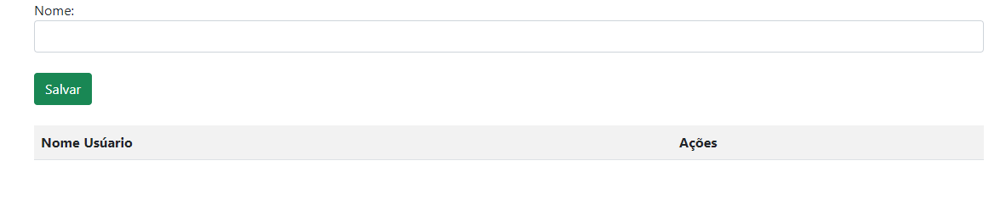
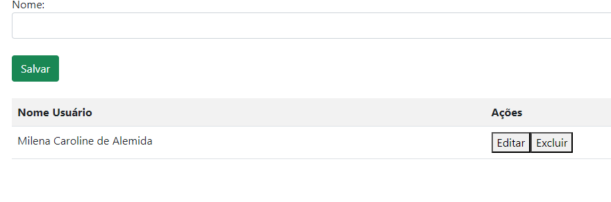

# Projeto de Cadastro de Usuários 🖋️

Este projeto é uma aplicação web simples para cadastrar, listar, editar e excluir nomes de usuários e seus e-mails. 
A interface permite ao usuário inserir um nome e um e-mail, que são armazenados em uma lista e exibidos em uma tabela. As funções de edição e exclusão estão disponíveis diretamente na tabela.


# Estrutura do Projeto 🔩

index.html: Página principal que contém a interface de login.

cadastro.html: Página de cadastro de usuários.

controller.js: Contém as funções JavaScript responsáveis pela lógica de manipulação dos dados e validação.

main.css: (Opcional) Arquivo de estilos CSS para customizar a aparência da aplicação.

Bootstrap: Biblioteca CSS externa para facilitar o uso de componentes visuais como botões e tabelas.

# 1. Interface de Usuário 🕶️

A interface da aplicação consiste em:

Página de Login:

Campos de entrada para e-mail e senha.
Botão "Acessar" que valida os campos e redireciona para a página de cadastro se os campos estiverem preenchidos corretamente.


# Página de Cadastro: 📝

Campos de entrada para o nome do usuário e e-mail.

Botão "Salvar" que adiciona os dados a uma lista.

Tabela que exibe todos os nomes e e-mails cadastrados, com botões para editar e excluir cada entrada.

# 2. Funcionalidades ⚙️

Validação de Acesso:

acessar(): Valida se os campos de e-mail e senha estão preenchidos corretamente. Se o e-mail não for válido ou algum campo estiver vazio, uma mensagem de alerta é exibida. Caso contrário, o usuário é redirecionado para a página de cadastro.

Adicionar Usuário:

salvarUser(): Salva o nome e o e-mail do usuário em arrays (dadosLista e EmailLista). Se o nome ou e-mail não estiverem preenchidos ou válidos, uma mensagem de alerta é exibida.

Listar Usuários:

criaLista(): Gera a tabela com os nomes e e-mails cadastrados e insere botões de ação (editar/excluir) para cada entrada.

Editar Usuário:

editar(i): Permite editar um nome e e-mail na lista, carregando os dados selecionados nos campos de entrada e removendo a entrada da tabela até que seja salva novamente.

Excluir Usuário:

excluir(i): Remove um nome e e-mail da lista e da tabela.

# 3. Código JavaScript 🧾

O arquivo controller.js contém as funções que gerenciam as interações do usuário:

# Neste campo mostra a validação de acesso

````

// Validação de acesso
function acessar() {
    let loginEmail = document.getElementById('loginEmail').value;
    let loginSenha = document.getElementById('loginSenha').value;

    if (!loginEmail || !loginSenha) {
        alert("Favor preencher todos os campos");
    } else if(document.forms[0].email.value == "" ||
        document.forms[0].email.value.indexOf('@') == -1 ||
        document.forms[0].email.value.indexOf('.') == -1){
            alert("Favor preencher seu Email corretamente!");
    } else {
        alert("Campos preenchidos com sucesso");
        window.location.href = 'cadastro.html';
    }
} 

````
# Neste campo mostra como é o armazenamento dos nomes e e-mails

````
// Armazenamento de nomes e e-mails
var dadosLista = [];
var EmailLista = [];

function salvarUser() {
    let nomeUser = document.getElementById('nomeUser').value;
    let emailUser = document.getElementById('emailUser').value;

    if (document.forms[0].emailcad.value == "" ||
        document.forms[0].emailcad.value.indexOf('@') == -1 ||
        document.forms[0].emailcad.value.indexOf('.') == -1) {
            alert("Favor informe seu Email corretamente!");
    } else if(nomeUser) {
         dadosLista.push(nomeUser);
         EmailLista.push(emailUser);
         criaLista();
         document.getElementById('nomeUser').value = "";
         document.getElementById('emailUser').value = "";
    } else {
        alert("Favor informe um nome para cadastro");
    }
} 
````
# Neste campo mostra como foi criada a lista de usuários

````
// Criação da lista de usuários
function criaLista() {
    let tabela = "<tr><th>Nome Usuário</th><th>Email</th><th>Ações</th></tr>";
    for (let i = 0; i < dadosLista.length; i++) {
        tabela += "<tr><td>" + dadosLista[i] + "</td><td>" + EmailLista[i] + "</td><td><button type='button' onclick='editar(" + (i + 1) + ")'>Editar</button><button type='button' onclick='excluir(" + (i + 1) + ")'>Excluir</button></td></tr>";
    }
    document.getElementById('tabela').innerHTML = tabela;
}

````
# Neste campo mostra a edição de usuários

````

// Edição de usuários
function editar(i) {
    document.getElementById('nomeUser').value = dadosLista[(i - 1)];
    document.getElementById('emailUser').value = EmailLista[(i - 1)];
    dadosLista.splice(i - 1, 1);
    EmailLista.splice(i - 1, 1);
}

````
# Neste campo mostra a exclusão de usuários

````

// Exclusão de usuários
function excluir(i) {
    dadosLista.splice(i - 1, 1);
    EmailLista.splice(i - 1, 1);
    document.getElementById('tabela').deleteRow(i);
}

````

# Tecnologias Utilizadas 💻

HTML5

JavaScript

Bootstrap 5

# Tela do projeto 🏞️



